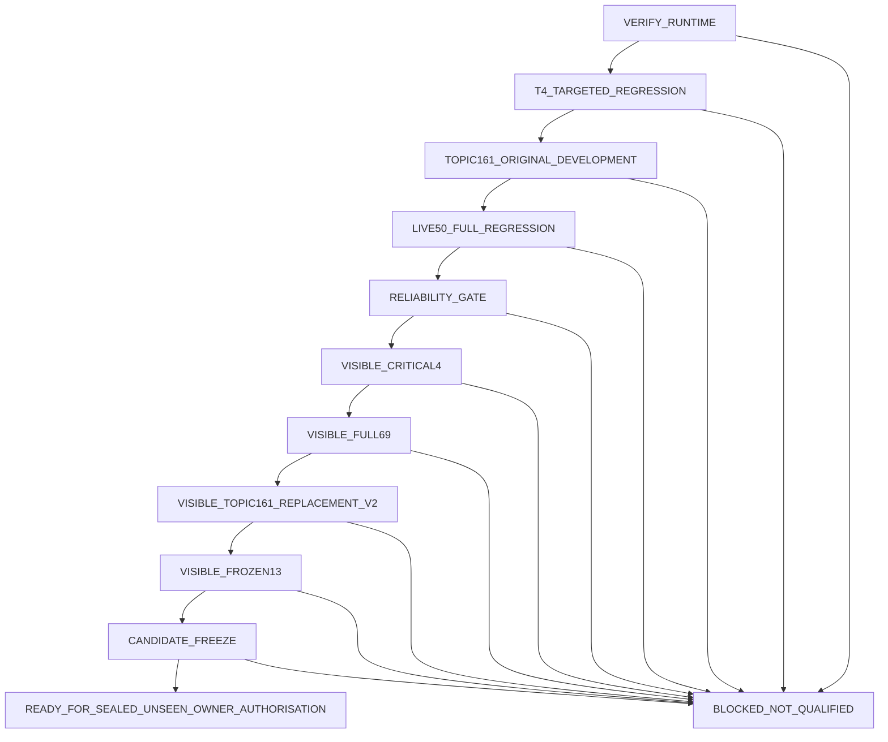

# Post-T4 qualification worker

**Owner review choice, 5 September 2026: AI.** See [review selection and strict acceptance rules](review-route-owner-selection-2026-09-05.md). This selects the existing two-reviewer Codex route and does not clear a qualification gate. The latest run, `post-t4-20260905071509-eb857ef9`, stopped during runtime startup before calibration; it was not awaiting human review. Human review remains a separately chosen alternative, with no automatic fallback or unverified human approval accepted by this controller.

The two named workers and their mandatory verification/source contract are documented in [two AI review workers](two-ai-review-workers.md). Each checks every hard gate, retains separate outputs and must pass independently. The controller runs them sequentially under its existing child-ownership protocol.

Operational readiness is tracked by validated gate artifacts. The implementation descriptions below are not proof that the complete workflow passed; the [current implementation plan](planning/2026-09-05-qualification-and-system-design-plan.md) identifies outstanding runtime, reliability and custody gaps.

The controller starts at `VERIFY_RUNTIME` and follows one fixed route:



Every answer must pass deterministic checks and two independent Codex reviews. A score of 70 is only a minimum. Both reviewers must map every material proposition to an allowed, hash-bound evidence record and pass every factual, citation, jurisdiction, safety, outcome, personal-fact, and certainty gate. Every factual or personal proposition must map to a source that was rendered inline for that claim. A JSON `citation_ids` declaration is not evidence: it must exactly mirror the unique inline citation markers, and an unresolved, hidden, unrelated, or declaration-only citation fails closed. Uncited policy evidence is limited to a finite list of source-controlled capability and refusal statements; any explanation or factual qualifier requires pinned source evidence.

`VERIFY_RUNTIME` calibrates the two isolated reviewers once against a fixed 16-case synthetic development pack: eight supported answers and eight deliberate failures covering subject/amount binding, negation, advice boundaries, conditions, dates, jurisdiction, scam safety, uncertain outcomes and citation entailment. Both reviewers must produce zero false approvals and zero false rejections. A calibration failure blocks the candidate; it does not start another review loop.

Every formal T4, original-topic161, Live-50, and visible-qualification answer is taken from the canonical loopback HTTP `/chat` route. The runtime signs a semantic response commitment over the exact run, stage, case, request ID, question, answer, route, jurisdiction, rendered sources, retry telemetry, and applied synthetic-context hash. It also returns a detached Ed25519 signature over the SHA-256 of the exact serialized HTTP response body in authenticated response headers. The runner preserves those raw bytes and headers in exclusive files; scorers, deterministic gates, the controller, and the Codex review packet independently verify both commitments. Reserializing or changing a response is ineligible to pass.

Every formal `/chat` request, including V2 development cases and every Live-50 retry, carries a short-lived, single-use capability bound to the run, stage, case, request ID, question, optional normalized context, expiry, and nonce. Nonce consumption is committed to the run directory with an exclusive file creation, so restarting the server cannot make a consumed capability reusable. The dashboard enforces a durable maximum of two consumed capabilities per run, stage, and case. Before scoring, the controller requires the complete consumed-nonce set to equal the request nonces in the final attempt ledger; an extra, omitted, malformed, duplicate, or cross-run record blocks the stage. The older 69-case pack also uses synthetic portfolio scenarios. Every case has an exact audited field and type allowlist. The runner removes assistant controls, expected product behavior, legal conclusions, corpus pointers, and quarantined embedded instructions before transmission; unknown, missing, mistyped, or instruction-like fields fail closed. Jurisdiction is derived only from the projected fixture values, and the controller recomputes the expected normalized context hash from the pinned input before accepting a result. Safe synthetic security metadata remains available to the security route while quarantined prompt-injection text remains excluded. The answer still passes through the product query processor, retrieval, model boundary, grounding validator, safety wording, citation renderer, persistence, and attempt telemetry.

The controller also generates an immutable allowed-context manifest directly from the hash-pinned 69-case input before it starts the runtime. Each entry binds the run, authorised visible stage, case ID, and exact normalized context SHA-256. The dashboard rehashes that manifest and requires exactly one matching entry before consuming any synthetic-context capability. This exact allowlist is the trust boundary for synthetic fixtures; wording filters remain defense in depth. A modified title, conversation, or fixture value is rejected even if its text does not match a known prompt-injection phrase.

The runtime creates a fresh Ed25519 response-signing key pair for each run. Only the owned dashboard child receives the private response-signing key, capability master key, and nonce-store path. Model and retrieval children receive none of those secrets. An authorised request runner receives one key derived for its exact stage, while scorers and other verifiers receive only the pinned public response key. Every stage and runtime child, including the dashboard, runs under a macOS sandbox that denies process-environment inspection, project-source writes, controller-state access, controller-signing-key access, predecessor-gate writes, and protected-directory rename operations. A stage runner can write only its current output directories. The dashboard can additionally write its configured database directory and consumed-nonce store. Tests execute real sandbox probes for allowed output writes and each prohibited operation. Each response receipt signs the request identity, question hash, exact served-answer hash, route, jurisdiction, sources, attempt telemetry, context hash, and request-capability receipt. Runners preserve the HTTP body as bytes before decoding JSON. The scorer, visible gate, and outer controller independently verify those bytes and reject any copied answer, source, claim citation, review text, jurisdiction, runtime identity, or telemetry field that differs from the signed response. Live-50 verifies every response attempt as well as the final selected response.

The factual status means **fact-checked against the pinned evidence supplied to the reviewers**. It is not a claim of universal or error-free truth. Missing, ambiguous, stale, unbound, or contradictory evidence blocks the case.

The runtime is pinned to checkpoint 104, its adapter, the complete base-model directory, the exact local embedding and reranker snapshots, the approved corpus manifest, the case-treatment graph used in prompts, canonical personal facts, prompts, validators, and evaluation parameters in `config/qualification-worker.json`. The whole configuration and its runtime section must match source-controlled canonical digests before the controller may create or resume work. Sampler, token, context, cache, prompt-template, thinking, remote-code, retry, probe, warm-up, polling, stage watchdog, and shutdown settings are part of the signed runtime digest; the model server rejects a different request policy. Qualification processes ignore `.env` and receive only an OS environment allowlist plus config-derived values. The launcher explicitly validates and forwards source identity, canonical user, attempt telemetry, retry, and truncation policy to the dashboard child.

Personal evidence supplied to the two Codex reviewers is generated in a separate sanitized process. That process ignores inherited datastore settings, opens only the configured SQLite path, and must reproduce the canonical personal-facts digest already verified from the runtime. Each stage merges every case-local fixture into the complete evidence catalog before hashing it. Source-ID collisions across runtime evidence and qualification fixtures are rejected unless content, scope, title, and provenance are identical. The complete stage catalog digest is part of the immutable AI review binding.

Each Codex review is preserved with an exclusive receipt that binds the exact raw output bytes, parsed result, raw JSONL execution events, packet, full configuration-byte hash, complete candidate identity, runtime configuration, AI-review configuration, trusted-evidence catalog, prompt, JSON schema, pinned reviewer executable, and clean process result. Every reviewer gets a fresh Codex home containing only a copied authentication record, runs from an empty scratch directory under a macOS sandbox that denies the project workspace, and starts with shell, browser, computer-use, app, MCP-adjacent and agent tool interfaces disabled. Any tool-bearing JSONL event rejects the review. Provider network transport remains available so the pinned Codex model can answer the supplied packet. Resume rejects a missing or changed receipt component before it can use a stored review.

`runtime/python-environments.json` pins dedicated model and retrieval virtual environments, recursive dependency closures, and every file, directory, and symlink in each importable standard-library and site-packages tree. Rebuild it explicitly with `node scripts/createPythonEnvironmentManifest.mjs` after an authorised dependency change. Both runtimes launch with Python `-I -B`, keeping user-site and environment startup disabled and preventing bytecode writes. Verified dependencies stay ahead of the writable project import root, and each required project-local Python module must resolve to its bound path before execution. The worker rehashes the Python environments and full model directories before every stage. The two Codex reviewers use pinned Node and Codex CLI absolute paths, file hashes, and CLI version. Iteration 312 is forbidden. Every request and model-generation attempt is recorded; incomplete transport telemetry, truncation recovery, an identity mismatch, or more than one retry blocks the run.

The worker runs development evaluation, visible qualification, deterministic scoring, and two independent Codex reviews automatically. It does not apply code changes automatically. A product failure produces immutable triage evidence for an owner-authored repair proposal, then ends at `BLOCKED_NOT_QUALIFIED`; an owner-reviewed repair starts a fresh run with new source hashes. It cannot start training, alter legal gold, read sealed unseen material, release, push Git changes, or change the origin remote. A model failure produces a draft training proposal and ends at `BLOCKED_NOT_QUALIFIED`.

`RELIABILITY_GATE` performs active tests against the exactly owned product runtime. It interrupts only the verified model-worker child, proves temporary unavailability, verifies a new worker PID and restart counter, then runs 15 sequential deterministic requests, four concurrent requests, the five repaired Live-50 journeys, a 100 ms cancellation, recovery canaries, and user/session-separation checks. Deterministic product responses must meet the declared five-second limit. Every request is signed and checked against the exact returned response body.

The sealed-unseen custodian is a separate owner-controlled runtime and never runs as a qualification-worker stage. It strips sealed question, gold, key, and token values from the dashboard environment; holds a separate ephemeral HMAC key and durable one-use nonce ledger; rejects gold, rubric, threshold, verdict, and expected-answer fields in injected context; and sends protected questions through the canonical `/chat` path. The main qualification worker has no custodian key or readable unseen material. The custodian command requires the existing explicit one-shot owner confirmation plus the frozen visible-gate and review bindings. It has been implemented and tested with synthetic canaries, but it must not be executed until the controller reaches `READY_FOR_SEALED_UNSEEN_OWNER_AUTHORISATION` and the owner separately authorizes that run.

Run locally with:

```bash
npm run qualification:plan
npm run qualification:preflight
npm run qualification:run
npm run qualification:status
```

`qualification:preflight` is read-only: it hashes every pinned qualification input, verifies checkpoint 104, the selected adapter, base-model weight, reviewer executables and replacement-suite cardinality, then exits nonzero with a classified blocker if any check fails. It does not create worker state, start a service, or execute one qualification stage. `qualification:run` continues until a permitted terminal state.

`npm run qualification:install-launchd` installs a resume-only persistent macOS worker after preflight. `npm run qualification:install-launchd -- --new-run` authorizes exactly one fresh run from an existing terminal state, then only resumes that new run. The request is bound to the exact config and worker hashes and never includes unseen authorization. The entrypoint verifies the signed event chain and terminal seal or failed-gate evidence before accepting a terminal state. It also records the exact spawned PID, executable and argv identity, consumes a fresh-run request only after a different run ID exists, refuses a mismatched pre-existing launch definition, and stops automatic relaunch when an identical state recurs. A terminal run can also be preserved and restarted with a fresh identity using `node scripts/qualificationWorker.mjs --new-run`; the controller stops only a runtime whose PID, executable, boundary-preserving argv, launcher, run ID, and random owner token all match its preserved record. Before and after every post-verification stage, the controller proves that the live endpoint is still served by that exact owner and stores the proof with the stage gate. The worker lock uses the same PID, executable, full-argv, identity digest, and random-token ownership rule to distinguish a live worker from PID reuse. Every development, Live-50, visible-qualification, and final-closure child result is reusable only with an immutable, hash-bound clean-exit receipt tied to its exact run, stage, command, inputs, and output artifacts. A timeout, signal, nonzero exit, incomplete receipt, or output without a receipt blocks the run. State, artifacts, consumed nonces, events, anchors, and seals are synced to their files and parent directories before a transition is treated as durable. Restart requires chain version 2 and an exact integer sequence, audits every worker event hash, predecessor, sequence, and run boundary, and verifies the anchor with a controller-only Ed25519 integrity key. Each signed `stage_passed` event commits the exact gate SHA-256, artifact-manifest SHA-256, artifact count, and predecessor SHA-256. The controller revalidates all committed gates and evidence before every stage, after each untrusted child exits, after each transition, and before terminal sealing. A missing, rewritten, or unsigned anchor, gate, transition, or artifact blocks. After `CANDIDATE_FREEZE`, a controller-signed exclusive terminal seal binds the final gate, the complete gate-chain root, the signed event-chain anchor, and both frozen-candidate manifests. The seal may be created only by the normal final transition; a missing, changed, or unsigned seal on resume blocks instead of being regenerated. Resume-chain integrity errors and ordinary failed stages stop the exactly owned runtime, durably remove live capability signing material after positive cleanup, persist cleanup evidence, end at `BLOCKED_NOT_QUALIFIED`, and release the worker lock.

After the final frozen technical preflight, the controller stops its exactly owned runtime and records the cleanup receipt before it may write `READY_FOR_SEALED_UNSEEN_OWNER_AUTHORISATION`.

Stage and Codex-review deadlines supervise the entire detached process group. Timeout or controller interruption sends bounded `SIGTERM`, verifies group disappearance, escalates to `SIGKILL` after the configured grace period, and records whether the group actually stopped. Every child and runtime spawn checks the interruption flag immediately before launch and immediately after owner registration. A leader exit cannot cancel descendant cleanup. A fresh run is created only after the prior run either proves that no runtime was ever started or positively completes exact-owner runtime cleanup.

The replacement-v2 input was refrozen after the owner authorized the proposal-listed 25 second-occurrence ID renames. It now has 161 rows and 161 unique IDs. The refreeze report proves question/gold positional alignment and an unchanged substantive-content digest; a separate immutable verification receipt validates the new manifest. The controlled-machine static preflight therefore passes, while replacement-v2 remains isolated and unopened until its declared visible-qualification stage. The latest formal run still completed zero gates: both sandboxed Node service launchers aborted with `SIGABRT` inside Node initialization, exact-owner cleanup completed, and no calibration or pension case was consumed.
